# sdnext-dynamic
This wraps our SDNext image with an entrypoint script that downloads a checkpoint based on an environment variable.

You can use the prebuild docker image as:
```
saladtechnologies/sdnext:dynamic
```

## Environment Variables
| Variable | Description | Default |
| -------- | ----------- | ------- |
| HOST | The host to listen on. Use `[::]` on Salad. | 0.0.0.0 |
| PORT | The port to listen on. This should match the port you configure for Salad networking. | 7860 |
| CIVITAI_MODEL_VERSION_IDS | A comma-separated list of model version IDs to download. ex `128713` for just [Dreamshaper 8](https://civitai.com/models/4384?modelVersionId=128713) or `128713,166808` for Dreamshaper and [Arterior](https://civitai.com/models/112229/arterior-digital-art-style). The rightmost value will be the default checkpoint when the server starts. | None |
| LOAD_REFINER | If set to `1`, the SDXL refiner model will be downloaded. | 0 |
| CLI_ARGS | Additional arguments to pass to the `sdnext` launch command. Options can be found with `--help` | None |
| EXTENSIONS | A comma separated list of extensions to load, each in the format of `name\|repoUrl`. e.g. `deforum\|https://github.com/deforum-art/sd-webui-deforum`  | None |

## Finding Your Model Version ID (Website)

1. Navigate to the Civit.ai page for the model you want to use
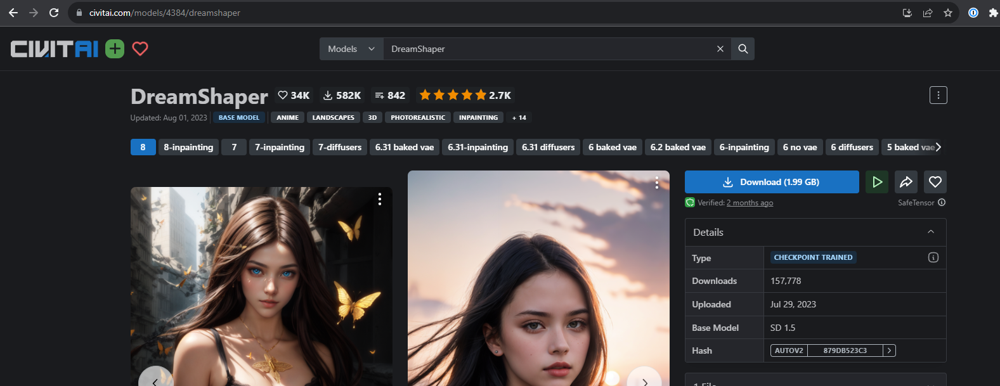

2. Click the version of the model you want to download
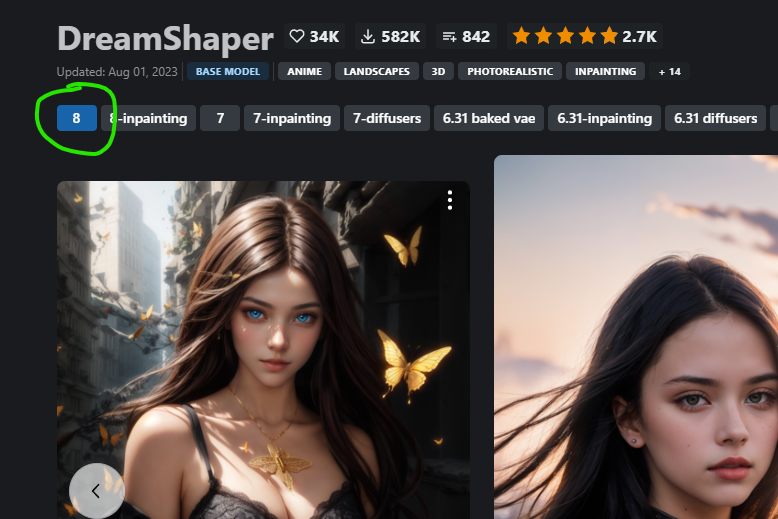

3. Copy the version ID from the URL
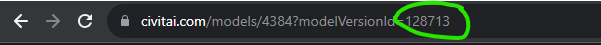

**OR**

2. Copy the link from the download button
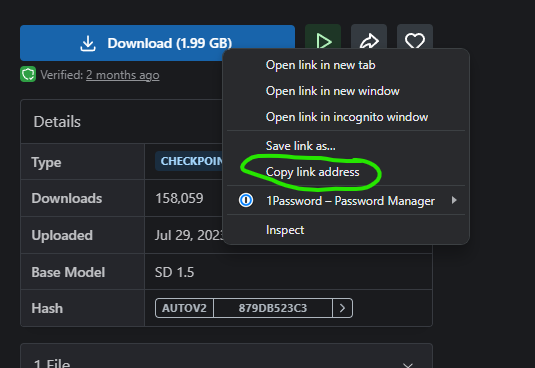

3. Paste the link into a text editor and copy the model version ID from the URL
```
https://civitai.com/api/download/models/128713
```

For this url, the model version id is `128713`.

## Finding Your Model Version ID (API)

1. Navigate to the Civit.ai page for the model you want to use


2. Grab the model ID from the URL
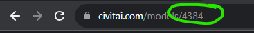

3. Use the API to get the model versions
```shell
curl  -X GET \
  'https://civitai.com/api/v1/models/4384'
```

You'll get a JSON response that includes a `.modelVersions` field:

```
"modelVersions": [
    {
      "id": 128713,
      "modelId": 4384,
      "name": "8",
      "createdAt": "2023-07-29T15:56:46.392Z",
      "updatedAt": "2023-08-01T13:38:21.400Z",
      "trainedWords": [],
      "trainingStatus": null,
      "trainingDetails": null,
      "baseModel": "SD 1.5",
      "baseModelType": "Standard",
      "earlyAccessTimeFrame": 0,
      "description": "<ul><li><p>Better at handling Character LoRA</p></li><li><p>Better at photorealism without sacrificing range (can still do art and anime pretty well, even if you might have to increase weight)</p></li><li><p>Better at NSFW</p></li></ul>",
      "vaeId": null,
      "stats": {
        "downloadCount": 157806,
        "ratingCount": 673,
        "rating": 4.9
      },
      "files": []
      ...
    }
]
```

Find the model version you want to use and copy the `id` field.


## Deploying on Salad (Portal)

As an example, we're going to deploy the Dreamshaper XL model

### Create a Deployment

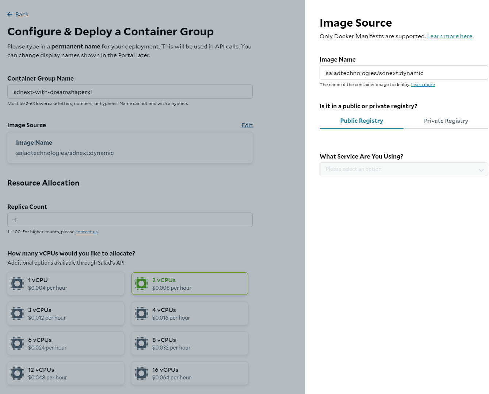

1. Name your deployment
2. Select the `saladtechnologies/sdnext:dynamic` image
3. Select how many vCPUs you need. For this we'll use 2
4. Select how much RAM you need. Since we plan on using the refiner model, we'll use 30GB

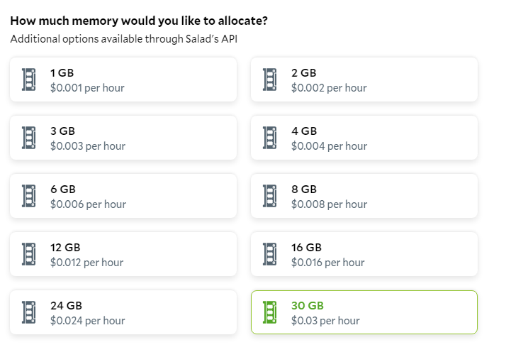

5. Select your GPUs. For and SDXL based model, we'll want GPUs with at least 16GB of VRAM.

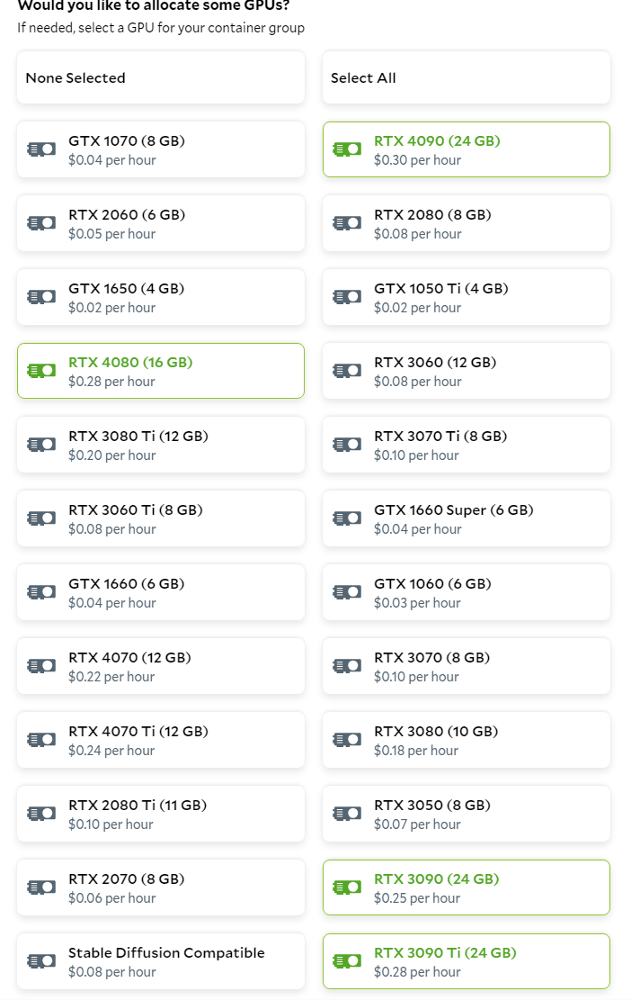

6. Click "edit" on the Networking section, and enable networking for port 7860 (the default port for SDNext).

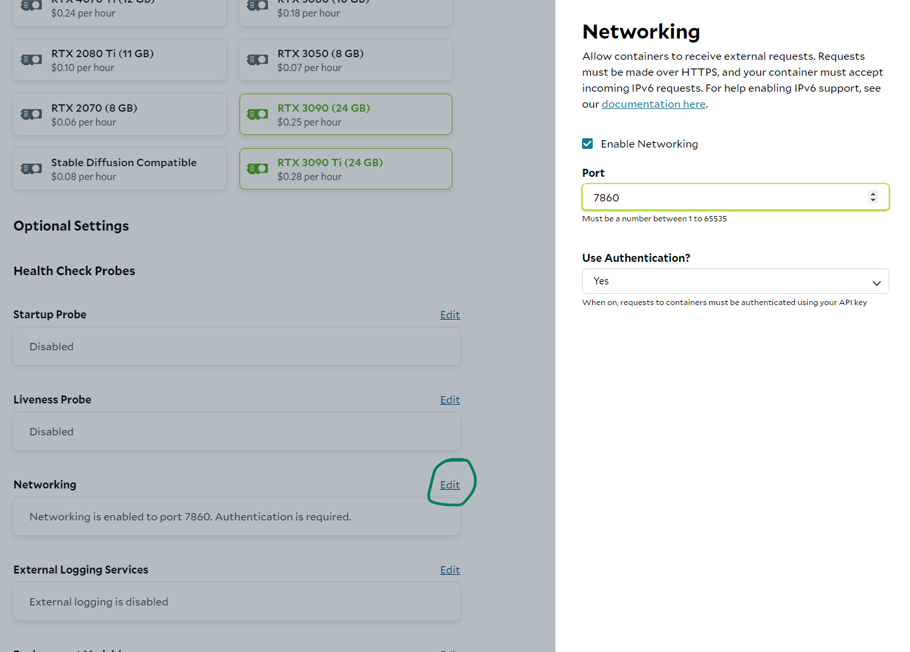

7. Click "edit" on the Environment Variables section, and add the following variables:
    - `HOST` with a value of `[::]`
    - `CIVITAI_MODEL_VERSION_IDS` with a value of `126688`
    - `LOAD_REFINER` with a value of `1`

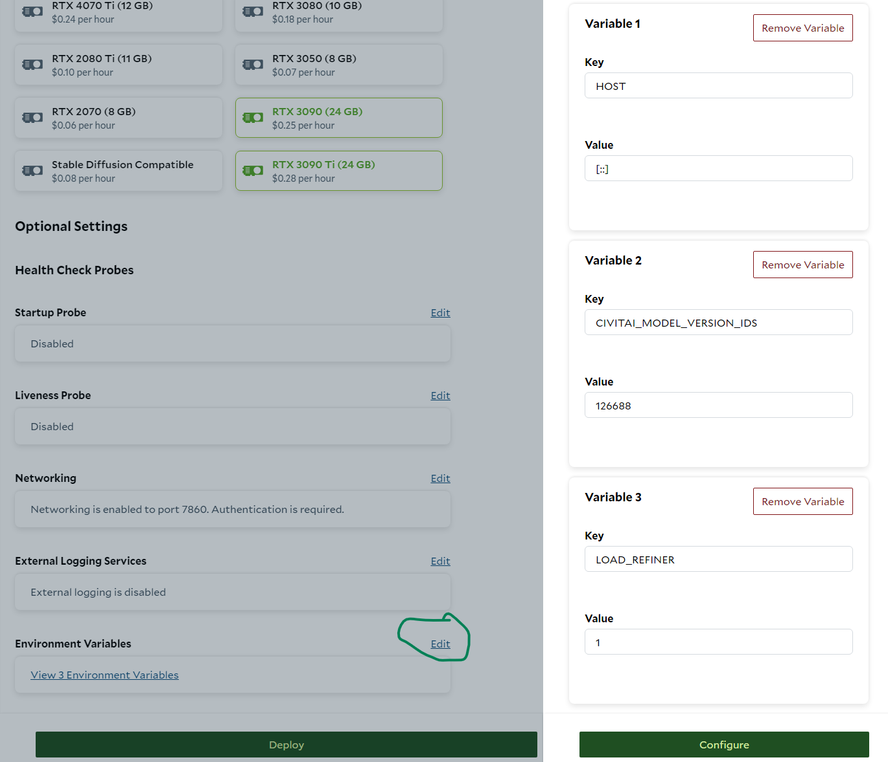

8. Click "Deploy" to finish creating your deployment. Then, click "Start" to start it.

### Your Finished Deployment

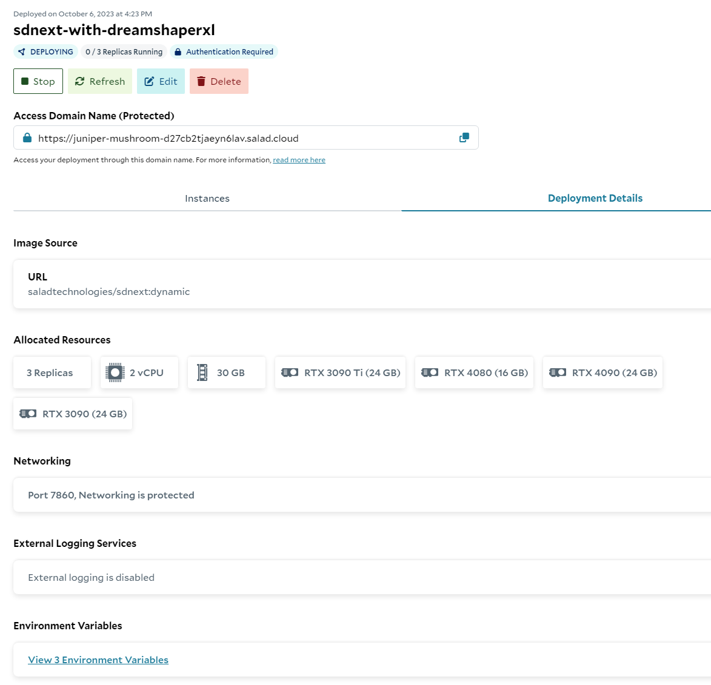

With the environment configured like this:

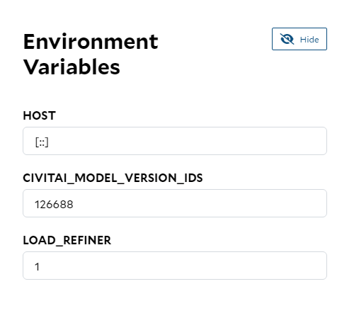